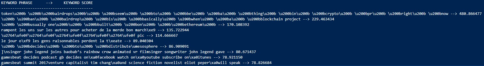

# Assignment \# 1: Identify Top Keywords
Attached is a small corpus of news articles published in 2017 (NewsArticles_Top10Keywords.csv). The goal of this task is to identify the top (10) keywords from this corpus. Egs. of keywords would be “blockchain”, “autonomous vehicles”, “Trump” etc. You can choose to define top the way you want to but it should be some measure of how popular the term is in this corpus.

This is a deliberately open-ended problem and doesn’t have a single solution. We mainly wish to see how you approach the problem given this data and the steps you took in getting to your solution (including any code, scripts that you write).

# Solution
1. Please briefly describe your approach
   
    I decided to use the [RAKE]('https://citeseerx.ist.psu.edu/viewdoc/download?doi=10.1.1.657.8134&rep=rep1&type=pdf') (Rapid Automatic Keyword Extraction) algorithm to extract the top keyword phrases from the news data. I chose it after doing research which suggested RAKE is a good alternative to other approaches (such as TF-IDF) due to its good efficiency and generally high performance.

    First, I ran a helper python script to help me convert the news data csv into a JSON file.
    
    ```> python csv_to_json.py```

    Then I ran the `main.go` script as follows. It takes that news JSON data, convert its into a [QFrame]('https://github.com/tobgu/qframe/tree/48bb5165415798e6c3f3d923421d85486b030d82') dataframe (think Pandas for GoLang), grabs the title and content fields and runs [this Go implementation]('https://github.com/afjoseph/RAKE.Go') of the RAKE algorithm on it.

    ```> go run main.go 10```

    The script writes the top K (10) keyword phrase-keyword score pairs into a txt file in the current directory.

2. How did you define what “top” is?
   
    Top is defined as the sum of member word scores in a given phrase. Member words scores are calculated as the ratio of
    degree(w)/frequency(w), where the degree of a word is the number of times it appears in a document and its frequency is a measure of co-occurence with other words in a phrase.

3. List the top 10 keywords here along with the metrics. If you’d like to show us a visualization for it, you could do that



4. If you were unable to complete your code in the allotted time, please describe what more you originally intended to implement.

    I would've tried to implement the algorithm in Go from scratch by myself (based of the paper) if I had had more time. This would've enabled me to understand RAKE better and make sense of the confusing output the algorithm yielded when I ran it on the news text.

5. If you had a few weeks(say 4-8) to do this task, what other approaches would you try and implement for this problem?

    I would try to implement the TF-IDF approach to the task of keyword detection from scratch in Go, and then compare the results with that of RAKE.